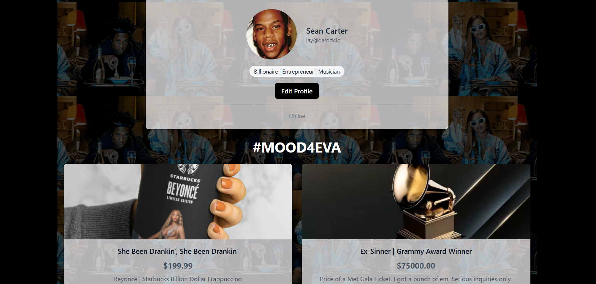

# React Component Library - Lab One



## Description

A modern React component library featuring reusable UI components built with TypeScript, Vite, and Tailwind CSS v4. This project demonstrates best practices in component composition, prop-based customization, and responsive design. Features include alert notifications, user profile cards, and product displays with a custom-styled interface including animated backgrounds and transparent card effects.

## Table of Contents

- [Technologies Used](#technologiesused)
- [Features](#features)
- [Future Features](#nextsteps)
- [Deployed App](#deployment)
- [About the Author](#author)

## <a name="technologiesused"></a>Technologies Used

- **React 18** - Component-based UI library with hooks
- **TypeScript** - Type-safe development with interfaces and props
- **Vite** - Fast build tool and development server
- **Tailwind CSS v4** - Utility-first styling with PostCSS
- **ESLint** - Code quality and consistency

## <a name="features"></a> Features

**Reusable Components** - Three fully customizable components (AlertBox, UserProfileCard, ProductDisplay)  
**Type Safety** - TypeScript interfaces for all component props  
**Alert System** - Four alert types (success, error, warning, info) with optional close button  
**User Profiles** - Avatar display with fallback initials, conditional email/role display  
**Product Cards** - Image display, pricing, stock status, and add-to-cart functionality  
**Responsive Design** - Mobile-first layout that adapts to all screen sizes  
**Custom Styling** - Animated GIF background with transparent card overlays  
**State Management** - React hooks for cart tracking and alert visibility  
**Component Composition** - Children props for extended functionality

**Completed Features:**

- [x] Transparent card backgrounds with 70% opacity
- [x] Responsive image and text alignment
- [x] Black background with mood.gif overlay
- [x] Centered layouts with max-width constraints
- [x] Black button styling with hover effects

## <a name="nextsteps"></a>Future Features

- **Component Testing** - Unit tests with Vitest and React Testing Library
- **Storybook Integration** - Component documentation and playground
- **Animation Library** - Framer Motion for smooth transitions
- **Form Components** - Input fields, checkboxes, and form validation
- **Modal System** - Overlay dialogs and confirmation prompts
- **Data Table Component** - Sortable, filterable data grids
- **Theme Customization** - Multiple color schemes and dark mode
- **Accessibility Enhancements** - ARIA labels and keyboard navigation
- **Icon Library Integration** - React Icons or custom SVG components

## <a name="deployment"></a>Deployed Link

**Live Application:**  
[GitHub Pages](https://cfra8189.github.io/lab-one/)

**Repository:**  
[GitHub Repository](https://github.com/cfra8189/lab-one)

## <a name="author"></a>About The Author

**Clarence Franklin**

- **GitHub:** [cfra8189](https://github.com/cfra8189)
- **Role:** Full-Stack Developer & UI/UX Designer

## Development Process

This project was built following:

- Component-driven development approach
- Git version control with feature commits
- Incremental implementation with testing at each stage
- Responsive-first design principles
- Type-safe development with TypeScript

## Installation & Setup

1. Clone the repository:

   ```bash
   git clone https://github.com/cfra8189/lab-one.git
   ```

2. Navigate to project directory:

   ```bash
   cd lab-one
   ```

3. Install dependencies:

   ```bash
   npm install
   ```

4. Start development server:

   ```bash
   npm run dev
   ```

5. View in browser at `http://localhost:5173/lab-one/`

## Build & Deploy

Build for production:

```bash
npm run build
```

Deploy to GitHub Pages:

```bash
npm run deploy
```

## Project Structure

```
lab-one/
├── src/
│   ├── components/
│   │   ├── AlertBox/
│   │   │   ├── AlertBox.tsx
│   │   │   └── AlertBox.test.tsx
│   │   ├── UserProfileCard/
│   │   │   ├── UserProfileCard.tsx
│   │   │   └── UserProfileCard.test.tsx
│   │   └── ProductDisplay/
│   │       ├── ProductDisplay.tsx
│   │       └── ProductDisplay.test.tsx
│   ├── types/
│   │   └── index.ts
│   ├── App.tsx
│   ├── App.css
│   ├── index.css
│   └── main.tsx
├── public/
├── index.html
├── vite.config.ts
├── tailwind.config.js
├── postcss.config.js
└── package.json
```

## Component Usage

### AlertBox

```tsx
<AlertBox
  type="success"
  message="Product added to cart!"
  onClose={() => setShowAlert(false)}
>
  <p>Additional content here</p>
</AlertBox>
```

### UserProfileCard

```tsx
<UserProfileCard
  user={userData}
  showEmail={true}
  showRole={true}
  onEdit={(userId) => console.log('Edit', userId)}
/>
```

### ProductDisplay

```tsx
<ProductDisplay
  product={productData}
  showDescription={true}
  showStockStatus={true}
  onAddToCart={(productId) => handleAddToCart(productId)}
/>
```

## Works Cited

- [React Documentation](https://react.dev/)
- [TypeScript Handbook](https://www.typescriptlang.org/docs/)
- [Tailwind CSS v4 Documentation](https://tailwindcss.com/docs)
- [Vite Guide](https://vitejs.dev/guide/)
- [MDN Web Docs - Flexbox](https://developer.mozilla.org/en-US/docs/Web/CSS/CSS_Flexible_Box_Layout)
- [React TypeScript Cheatsheet](https://react-typescript-cheatsheet.netlify.app/)
